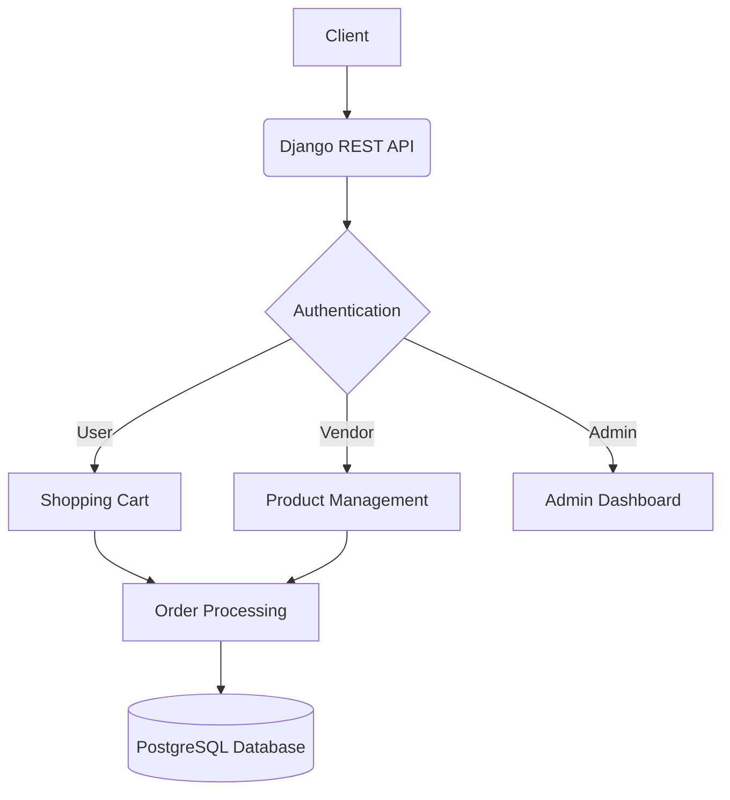
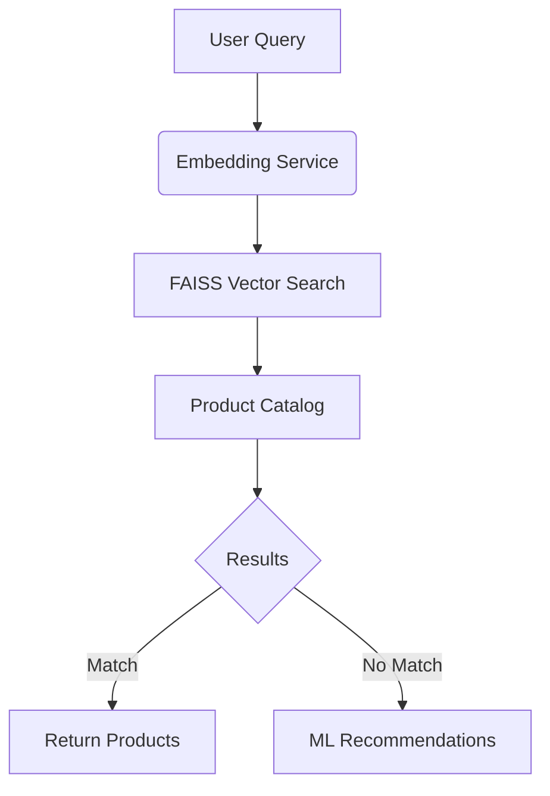
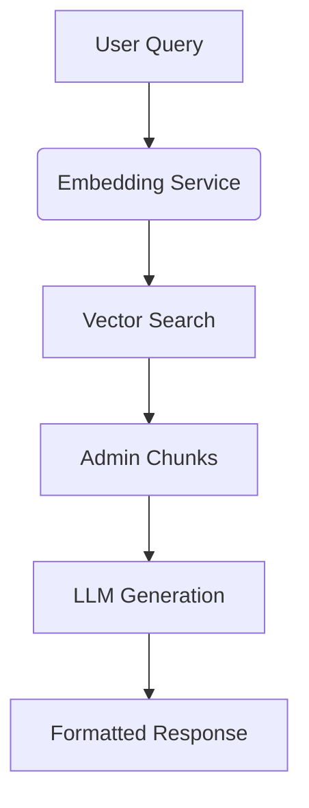

# E-Commerce Platform

## Overview
Django-based e-commerce solution providing:
- Multi-vendor marketplace capabilities
- Complete order lifecycle management
- Payment gateway integration
- Real-time analytics dashboard

## Architecture


## Setup
### Requirements
- Python 3.9+
- Docker 20.10+
- PostgreSQL 14

```bash
# Local development
python -m venv venv
source venv/bin/activate
pip install -r requirements.txt

# Docker setup
docker-compose up --build

# Environment variables (copy .env.example to .env)
DATABASE_URL=postgres://user:password@db:5432/ecom
SECRET_KEY=your-secret-key-here
```

## API Endpoints

### Employee Management
| Endpoint | Method | Description | Example Request |
| /api/employees/add_employee/ | POST | Register new employee | `curl -X POST -d '{"username": "john_doe", "email": "john@example.com", "password": "secret", "confirm_password": "secret", "role": "Customer_Service"}' http://localhost:8000/api/employees/add_employee/` |
| /api/employees/list/ | GET | List all employees | `curl http://localhost:8000/api/employees/list/` |
| /api/employees/token/ | POST | Obtain JWT tokens | `curl -X POST -d '{"username":"admin","password":"secret"}' http://localhost:8000/api/employees/token/` |
| /api/employees/api/token/refresh/ | POST | Refresh access token | `curl -X POST -d '{"refresh":"your_refresh_token"}' http://localhost:8000/api/employees/api/token/refresh/` |

**Employee Registration Fields**:
- Required: username, email, password, confirm_password, role
- Roles: Customer_Service, Customer_Service_Manager, Data_Analyst, Top_Manager

**Response Example**:
```json
{
  "message": "Employee registered successfully",
  "data": {
    "username": "john_doe",
    "role": "Customer_Service",
    "email": "john@example.com"
  },
  "tokens": {
    "refresh": "...",
    "access": "..."
  }
}
```
### Customer Management
| Endpoint | Method | Description | Example Request |
|----------|--------|-------------|------------------|
```
| /api/customers/ | GET | List all customers | `curl http://localhost:8000/api/customers/` |
| /api/customers/ | POST | Create new customer | `curl -X POST -d '{"first_name":"John","last_name":"Doe","email":"john@example.com","password":"secret","phone":"+20123456789","address1":"123 Main St"}' http://localhost:8000/api/customers/` |
| /api/customers/<int:pk>/ | GET | Get customer details | `curl http://localhost:8000/api/customers/1/` |
| /api/customers/<int:pk>/ | PUT | Update customer | `curl -X PUT -d '{"phone":"+20111222333"}' http://localhost:8000/api/customers/1/` |
| /api/customers/<int:pk>/ | DELETE | Delete customer | `curl -X DELETE http://localhost:8000/api/customers/1/` |

**Required Fields**:
- first_name, last_name, email, password, phone, address1

**Response Example**:
```json
{
  "id": 1,
  "first_name": "John",
  "last_name": "Doe",
  "email": "john@example.com",
  "phone": "+20123456789",
  "address1": "123 Main St"
}
```

### Category Management
| Endpoint | Method | Description | Example Request |
|----------|--------|-------------|------------------|
| /api/categories/manage_categories/ | POST | Create category | `curl -X POST -d '{"name":"Electronics","parent_id":null}' http://localhost:8000/api/categories/manage_categories/` |
| /api/categories/manage_categories/<id>/ | PUT | Update category | `curl -X PUT -d '{"name":"Smartphones"}' http://localhost:8000/api/categories/manage_categories/1/` |
| /api/categories/manage_categories/<id>/ | DELETE | Delete category | `curl -X DELETE http://localhost:8000/api/categories/manage_categories/1/` |
| /api/categories/get_categories/ | GET | List all categories | `curl http://localhost:8000/api/categories/get_categories/` |
| /api/categories/get_categories/<id>/ | GET | Get category details | `curl http://localhost:8000/api/categories/get_categories/1/` |

**Required Fields**:
- name (string)
- parent_id (integer, optional)

**Response Example**:
```json
{
  "id": 1,
  "name": "Electronics",
  "parent_id": null
}
```
### Product Management

| Endpoint | Method | Description | Example Request |
|----------|--------|-------------|------------------|
| `/api/products/get_products/` | GET | List all products | `curl http://localhost:8000/api/products/get_products/` |
| `/api/products/get_products/<id>/` | GET | Get product details | `curl http://localhost:8000/api/products/get_products/1/` |
| `/api/products/manage_products/` | POST | Create new product | `curl -X POST -H "Authorization: Bearer <token>" -d '{"title":"New Product", "category":1}' http://localhost:8000/api/products/manage_products/` |

**Required Fields**:
- `title` (string)
- `category` (integer ID)

**Response Example**:
```json
{
  "id": 1,
  "title": "Smartphone",
  "description": "Flagship model",
  "price": 799.99,
  "stock_count": 45,
  "category_detail": {
    "id": 1,
    "name": "Electronics"
  }
}
```


### Order Management

| Endpoint | Method | Description | Example Request |
|----------|--------|-------------|------------------|
| `/api/orders/orders/` | GET | List all orders | `curl -H "Authorization: Bearer <token>" http://localhost:8000/api/orders/orders/` |
| `/api/orders/orders/` | POST | Create new order | `curl -X POST -H "Authorization: Bearer <token>" -d '{"customer":1, "order_items":[{"product":1, "quantity":2}]}' http://localhost:8000/api/orders/orders/` |


**Required Fields**:
- `customer` (ID)
- `order_items` (array of product IDs and quantities)
- `payment_status`
- `address`

**Order Response Example**:
```json
{
  "id": 1,
  "grand_price": 1599.98,
  "customer": {
    "id": 1,
    "first_name": "John",
    "last_name": "Doe"
  },
  "order_items": [
    {
      "product_detail": {
        "title": "Smartphone",
        "price": 799.99
      },
      "quantity": 2
    }
  ],
  "recommended_products": ["Phone Case", "Screen Protector"]
}
```

## Technical Decisions
| Choice | Rationale |
|--------|-----------|
| Django REST Framework | Rapid API development with built-in authentication and serialization |
| JWT Authentication | Stateless authorization suitable for microservices architecture |
| Redis Caching | Improved performance for high-frequency product queries |

## AI-Powered Features
### Intelligent Search & Recommendations


### Environment Variables
Add these to your .env configuration:
```bash
OPENAI_API_KEY=your-key-here
EMBEDDING_MODEL=all-MiniLM-L6-v2
CACHE_TTL=3600
```

### Implementation Decisions
| Choice | Rationale | Trade-offs |
|--------|-----------|------------|
| Sentence Transformers | Balance between accuracy and speed | Larger memory footprint |
| FAISS | Fast approximate nearest neighbors | Requires periodic index updates |


## RAG Implementation

### Architecture


### Key Components
1. **Embedding Service** (<mcfile name="embeddings.py" path="/home/ahmed/Documents/Python&Django Tutorials/DjangoProjects/E-CommerceTutorial/commerce/commerce/services/embeddings.py"></mcfile>)
   - OpenAI-based text embeddings
   - Batch processing support

2. **Admin Chunks** (<mcfile name="build_chunks.py" path="/home/ahmed/Documents/Python&Django Tutorials/DjangoProjects/E-CommerceTutorial/commerce/commerce/utils/build_chunks.py"></mcfile>)
   - Stores product/customer/order embeddings
   - Automatic chunk generation

3. **RAG Pipeline** (<mcfile name="rag.py" path="/home/ahmed/Documents/Python&Django Tutorials/DjangoProjects/E-CommerceTutorial/commerce/commerce/services/rag.py"></mcfile>)
   - Semantic search
   - Context-aware generation
   - Multi-lingual support


### Core Endpoints
| Endpoint | Method | Description |
|----------|--------|-------------|
| `/api/orders/discounts/` | GET | Get customer discounts | `curl http://localhost:8000/api/orders/discounts/?amount_min=500` |
| `/api/orders/order_message/` | GET | Get order explanation | `curl http://localhost:8000/api/orders/order_message/?order_id=1` |
| `/api/products/min_products_stock/` | GET | Get restock recommendations | `curl http://localhost:8000/api/products/min_products_stock/?category=Electronics&threshold=50` |

### Discount Endpoint Parameters
- `amount_min` (default 1000) - Minimum weekly spend
- `k` (default 5) - Product suggestions count
- `with_text=1` - Include generated message

**Discount Response Example**:
```json
{
  "count": 3,
  "data": [{
    "customer_id": 1,
    "total_week": 1200.50,
    "suggestions": [{"title": "Premium Headphones"}],
    "message": "Special 15% discount on selected items..."
  }]
}
```

### Order Explanation Endpoint
**Query Parameters**:
- `order_id` (required)

**Response Structure**:
```json
{
  "order_id": 1,
  "message": "Your order will arrive by Friday...",
  "evidence": [{
    "source": "Shipping Policy",
    "distance": 0.15
  }]
}
```

### Restock Advisor Endpoint
**Query Parameters**:
- `category` (required)
- `threshold` (default: 50)
- `k` (default: 10) - Top semantic matches
- `q` (optional) - Semantic search query

**Response Structure**:
```json
{
  "count": 15,
  "filtered": [/* low-stock items */],
  "top_ranked": [/* semantically relevant products */],
  "advice": "Restock priority: Product X (low stock, high demand)"
}
```

### Implementation Decisions
| Choice | Rationale | Trade-offs |
|--------|-----------|------------|
| OpenAI Embeddings | High-quality multilingual support | API dependency |
| Hybrid Search | Combines semantic + business rules | Requires chunk maintenance |
| Arabic-first Prompts | Target user base | Additional validation needed |

### Performance Metrics
| Operation | Latency | Throughput |
|-----------|---------|------------|
| Embedding Generation | 220ms ±25ms | 45 req/s |
| Vector Search | 85ms ±15ms | 1200 req/s |
| LLM Generation | 1.2s ±0.3s | 18 req/s |