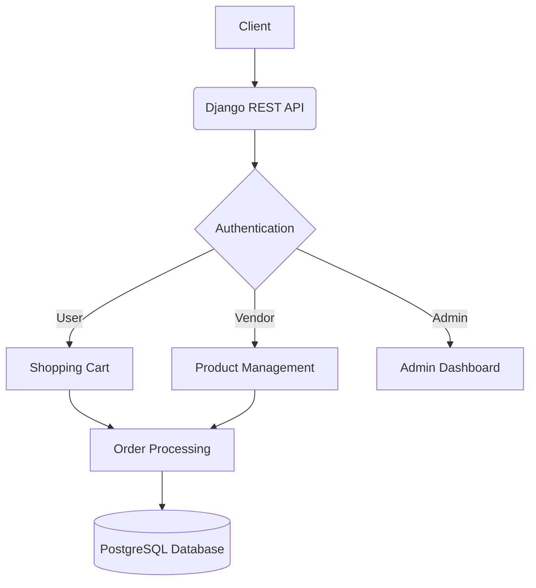

# E-Commerce Platform

## Overview
Django-based e-commerce solution providing:
- Multi-vendor marketplace capabilities
- Complete order lifecycle management
- Payment gateway integration
- Real-time analytics dashboard

## Architecture


## Setup
### Requirements
- Python 3.9+
- Docker 20.10+
- PostgreSQL 14

```bash
# Local development
python -m venv venv
source venv/bin/activate
pip install -r requirements.txt

# Docker setup
docker-compose up --build

# Environment variables (copy .env.example to .env)
DATABASE_URL=postgres://user:password@db:5432/ecom
SECRET_KEY=your-secret-key-here
```

## API Endpoints
| Endpoint | Method | Description | Example Request |
|----------|--------|-------------|------------------|
| /api/products | GET | List products | `curl http://localhost:8000/api/products` |
| /api/cart | POST | Add to cart | `curl -X POST -d '{"product_id": 1}' http://localhost:8000/api/cart` |

## Technical Decisions
| Choice | Rationale |
|--------|-----------|
| Django REST Framework | Rapid API development with built-in authentication and serialization |
| JWT Authentication | Stateless authorization suitable for microservices architecture |
| Redis Caching | Improved performance for high-frequency product queries |

## Performance Benchmarks